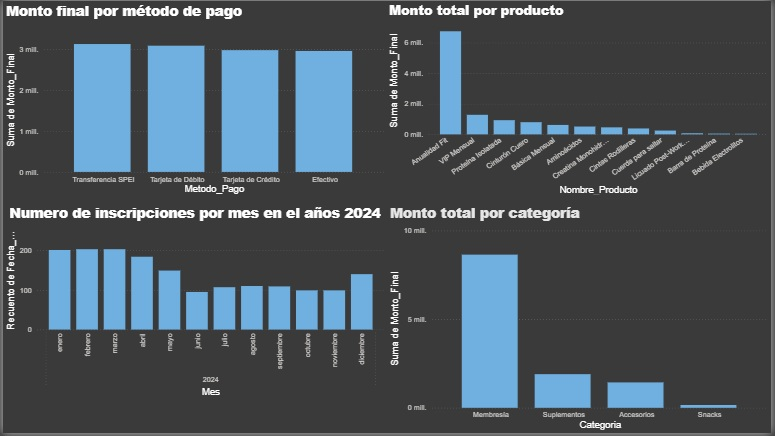
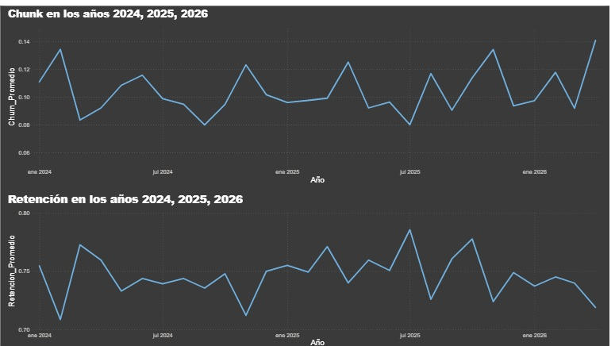

# 🚔 Análisis de KPI'S para un gimnasio | Análisis de datos BI 

## 📌 Objetivo del proyecto

En este proyecto vamos a desarrollar un modelo estrella muy pequeño e implementar el proceso ETL para extraer, transformar y cargar los datos en Power BI para obtener el chunk, la retanción de clientes, los ingresos promedios a lo largo del 2024, 2025 y 2026. 

---

## 🛠️ Tecnologías utilizadas

  

- Python
- Power BI
- Excel 
- Pandas  

---

## 🧱 Arquitectura del proyecto

  

---

## 🎥 Videos del proyecto

<table>
<tr>

<td align="center">

## 🎥 Explicación en Español

### 🇺🇸 English Version

</td>

</tr>
</table>

---

## 📊 Dashboard y visualizaciones

### Dashboard Power BI

  
</a>

  
</a>

  
</a>

---

## 📂 Repositorio del proyecto

🔗 [Ver repositorio completo](https://github.com/EduardoGarcia12/An-lisis-de-datos-BI-)

---

## ⚙️ Flujo de trabajo del pipeline

1. Generación de los datos con ayuda de Gemini. 
2. Limpieza, validación y transformación de datos utilizando Python y Pandas.
3. El proceso ETL nos genera tres archivos CSV limpio de mis datos. 
4. Visualización y análisis de los datos con Power Bi.
---

## 📈 Resultados obtenidos

- El Chunk con valor mas alto fue en Abril del año 2026 con un 14%, mientras que la retención de los usuarios fue de 79% en el mes de julio del 2025.  
- Cuando graficamos el ARPM y MRR a lo largo del tiempo vimos que el mayor valor del ARPM fue en Febrero del 2025, con un valor de 7391.71, suposimos que la mensualidad se cobraba en promedio 400 pesos, entonces, como este 7391.71 es mayor a 400, esto es fue una señal positiva de que los complementos funcionan bien. 
- Mientras que el MMR con mayor valor fue en el mes de Marzo del 2025 con un valor de 130800 pesos, esto recordando que son los ingresos que generan los usuarios activos.  

---

## 🧠 Qué aprendí

- Calcular medidas usando DAX en Power BI. 
- Procesos ETL utilizando Python.
- Manejo de Power BI para organizar la información. 
- Diseño de dashboards para la visualización de KPI'S.
- Implementar el modelo estrella.  

---

## 🚀 Futuras mejoras

- Tratar de escalar el problema integrando mas tablas al modelo estrella. 
- Crear modelos predictivos en función de las KPI'S que calculamos en Power BI.  

